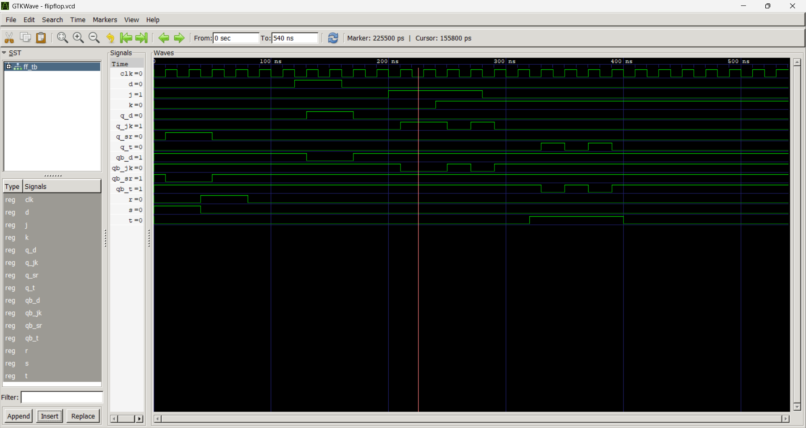

# **VHDL Code for Sequential Circuits: Flip-Flops**

## 1. Objective

* To study the concept of sequential circuits.
* To understand the working principle of SR, D, JK, and T flip-flops.
* To design and simulate different types of flip-flops using VHDL.
* To analyze the behavior of flip-flops using simulation.
* To understand the applications of flip-flops in digital systems.

---

## 2. Theory

Sequential circuits are digital circuits whose outputs depend on both the present inputs and the previously stored state. Unlike combinational circuits, sequential circuits contain memory elements that can store binary information. The most common memory element is the **flip-flop**, which stores one bit of data.

A flip-flop is a bistable device with two stable states representing logic **0** and **1**. It changes its state only when triggered by a clock signal, making it suitable for synchronous digital systems. Flip-flops are widely used in registers, counters, shift registers, memory devices, processors, and finite state machines.

### **SR (Set-Reset) Flip-Flop**

The SR Flip-Flop is the simplest type of flip-flop. It has two inputs: **Set (S)** and **Reset (R)**. The Set input changes the output to logic 1, while the Reset input changes the output to logic 0. When both inputs are low, the previous output is retained. If both inputs are high simultaneously, an invalid condition occurs because the output becomes unpredictable.

**Truth Table**

| S | R | Q (Next State) |
| - | - | -------------- |
| 0 | 0 | No Change      |
| 0 | 1 | 0              |
| 1 | 0 | 1              |
| 1 | 1 | Invalid        |

---

### **D (Data) Flip-Flop**

The D Flip-Flop has a single input called the Data input. It eliminates the invalid condition found in the SR Flip-Flop. At every active edge of the clock signal, the output becomes equal to the input data and remains stored until the next clock pulse. Because of its simple operation, the D Flip-Flop is widely used in memory elements, registers, and data storage systems.

**Truth Table**

| D | Q (Next State) |
| - | -------------- |
| 0 | 0              |
| 1 | 1              |

---

### **JK Flip-Flop**

The JK Flip-Flop is an improved version of the SR Flip-Flop. It removes the invalid condition by allowing both inputs to be high simultaneously. When both inputs are high, the output toggles to the opposite state. Due to this feature, the JK Flip-Flop is commonly used in counters and sequential control circuits.

**Truth Table**

| J | K | Q (Next State) |
| - | - | -------------- |
| 0 | 0 | No Change      |
| 0 | 1 | 0              |
| 1 | 0 | 1              |
| 1 | 1 | Toggle         |

---

### **T (Toggle) Flip-Flop**

The T Flip-Flop has only one input called **Toggle (T)**. When T is **0**, the output remains unchanged. When T is **1**, the output changes to its opposite state at every active clock edge. This characteristic makes the T Flip-Flop useful in binary counters and frequency divider circuits.

**Truth Table**

| T | Q (Next State) |
| - | -------------- |
| 0 | No Change      |
| 1 | Toggle         |

---

## 3. Simulation Result

---

## 4. Applications

* Registers
* Shift Registers
* Binary Counters
* Memory Devices
* Digital Clocks
* Frequency Divider Circuits
* Finite State Machines
* Microprocessors
* Data Storage Systems
* Digital Communication Systems

---

## 5. Discussion

This experiment provided practical knowledge of sequential circuit design using VHDL. The behavior of SR, D, JK, and T flip-flops was studied and verified through simulation. Each flip-flop has unique characteristics and applications depending on the required functionality. The D Flip-Flop is mainly used for data storage, while JK and T Flip-Flops are widely used in counters and sequential logic circuits. The experiment also demonstrated the importance of simulation in verifying circuit functionality before hardware implementation.

---

## 6. Conclusion

The design and analysis of SR, D, JK, and T flip-flops using VHDL were successfully studied. The simulation results agreed with the theoretical operation of each flip-flop, confirming their correct functionality. This experiment improved the understanding of sequential circuits, memory elements, and clock-based operation. Flip-flops are essential building blocks in modern digital systems and play a significant role in the design of reliable and efficient electronic circuits.

